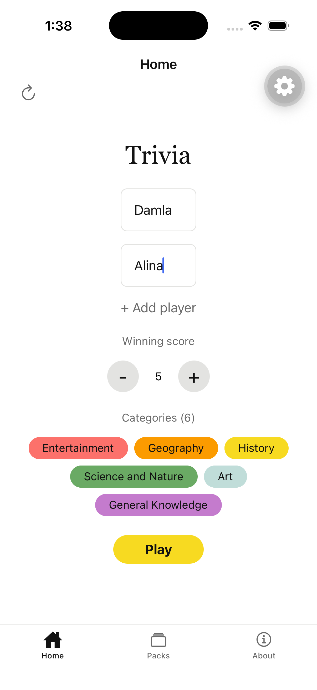
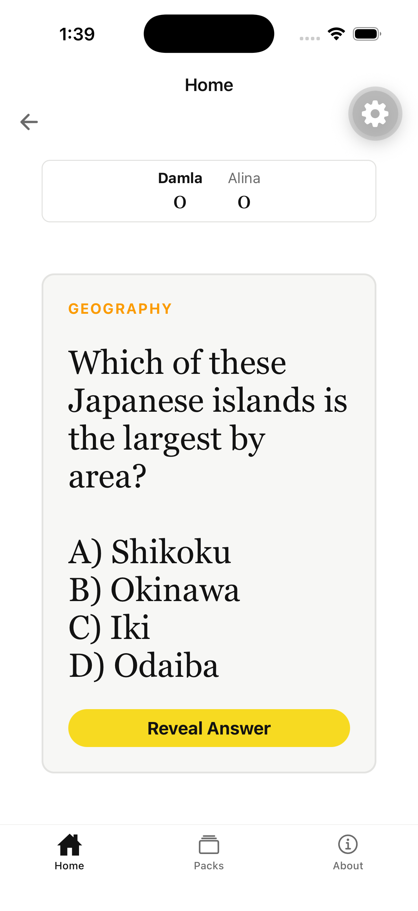
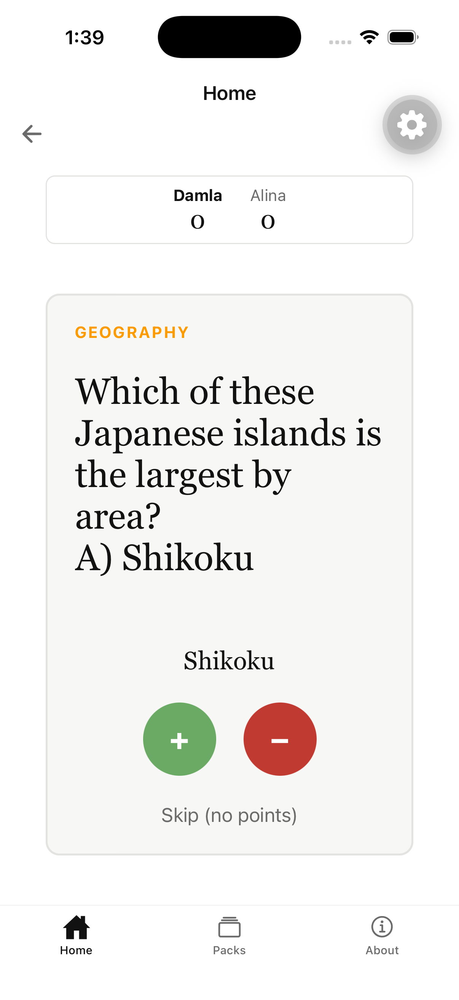

<p align="center">
  
</p>

<p align="center">
  <a href="https://github.com/damla-bortucen/trivia-app/blob/main/LICENSE">
    <picture>
      <source media="(prefers-color-scheme: dark)" srcset="https://shieldcn.dev/github/license/damla-bortucen/trivia-app.svg?variant=secondary&size=sm&mode=dark" />
      
    </picture>
  </a>
  <a href="https://docs.expo.dev/versions/v57.0.0/">
    <picture>
      <source media="(prefers-color-scheme: dark)" srcset="https://shieldcn.dev/badge/Expo%20SDK-57-000000.svg?logo=expo&variant=secondary&size=sm&mode=dark" />
      
    </picture>
  </a>
  <a href="https://react.dev">
    <picture>
      <source media="(prefers-color-scheme: dark)" srcset="https://shieldcn.dev/badge/React-19.2-61DAFB.svg?logo=react&variant=secondary&size=sm&mode=dark" />
      
    </picture>
  </a>
  <a href="https://www.typescriptlang.org">
    <picture>
      <source media="(prefers-color-scheme: dark)" srcset="https://shieldcn.dev/badge/TypeScript-6.0-3178C6.svg?logo=typescript&variant=secondary&size=sm&mode=dark" />
      
    </picture>
  </a>
  <a href="https://github.com/damla-bortucen/trivia-app/commits">
    <picture>
      <source media="(prefers-color-scheme: dark)" srcset="https://shieldcn.dev/github/last-commit/damla-bortucen/trivia-app.svg?variant=secondary&size=sm&mode=dark" />
      
    </picture>
  </a>
</p>

## About

A pass-and-play trivia game for 2 to 6 players. Everyone shares one phone: spin
for a category, pick a difficulty, read the question aloud, and the group decides
whether the answer counted.

Built with Expo SDK 57, React Native 0.86 and expo-router. 18 packs, 2,501
questions, all bundled with the app so it plays offline.

### Screenshots

<p align="center">
  
  
  
</p>

## Requirements

- Node 20 or newer
- A development build. The app uses `react-native-mmkv`, which is not available
  in Expo Go.

## Getting started

```bash
npm install
npx expo start --dev-client   # press i for the iOS simulator, a for Android
```

To build the native projects locally:

```bash
npm run ios
npm run android
```


## Structure

Routes live in `src/app/` (not `app/`), with `@/*` aliased to `src/*` and
`@/assets/*` to `assets/*`.

`src/game/game_logic.ts` holds the rules as pure functions: each one takes a
`GameState` and returns a new one, and nothing mutates state in place. There is
no reducer or state library. `src/app/(tabs)/index.tsx` owns the only `GameState`
and decides which screen to show — start, question, board or results. It also
wraps `setState` so every change is written to MMKV, which is why components
never touch storage themselves.

Styling goes through `src/ui/theme.ts`. Local `StyleSheet.create` blocks should
hold layout only; typography and colour belong in the theme.

## Packs

A pack is a category. Each one is a JSON file in `assets/packs/` shaped like:

```json
{
  "id": "music-ai",
  "name": "Music",
  "description": "Songs, artists and the records they made.",
  "color": "#8de3d6",
  "source": "generated",
  "questions": [
    {
      "id": "music-ai-001",
      "category": "music-ai",
      "question": "What does forte mean on a score?",
      "answer": "Loud",
      "difficulty": "easy",
      "points": 1
    }
  ]
}
```

`source` is either `opentdb` or `generated`, and drives the badge and grouping on
the Packs tab. Points come from difficulty: easy 1, medium 2, hard 3. Players may
select up to `MAX_PACKS` (6) at a time.

### Generating from Open Trivia DB

```bash
node scripts/fetch-opentdb.js
```

Rebuilds every OpenTDB pack from the table at the top of the script, which maps
each pack to one or more OpenTDB category ids. Uses `API_DELAY_MS` to stay inside 
the rate limit, so a full run takes a while, and it overwrites the existing files.

### Generating with AI

Needs `OPENAI_API_KEY` and `OPENAI_MODEL` in `.env` (gitignored).

```bash
node --env-file=.env scripts/generate-pack.js music-ai        # dry run, full counts
node --env-file=.env scripts/generate-pack.js music-ai 5      # dry run, 5 per difficulty
node --env-file=.env scripts/generate-pack.js music-ai --save # writes the pack
```

Questions come from a blueprint in `scripts/blueprints/<id>.json`:

| Field | Purpose |
| --- | --- |
| `theme` | One sentence describing the subject |
| `angles` | Ways into the topic; the model is told to use each at least once |
| `avoid` | Subjects and question shapes to stay away from |
| `counts` | How many easy, medium and hard questions to write |

Everything the model returns passes through `validate()`, which drops questions
with a missing question or answer, an unknown difficulty, a duplicate of an
earlier question, or an answer longer than five words. Rejections are printed
with the reason.

A dry run prints the questions and writes nothing. Add `--save` once the output
looks right; it overwrites `assets/packs/<id>.json`.

Reasoning models can think for longer than Node's default five minute header
timeout, so the script installs an undici dispatcher with that limit disabled.
Without it, a full pack never returns.

### Registering a pack

Generating a file is not enough — `src/game/packs.ts` imports each pack
explicitly. Add the import and an entry in the `PACKS` array, or it will not
appear in the app.

## Saved games

An unfinished game is written to MMKV and offered back on next launch. Saves are
stamped with `SAVE_VERSION` in `src/game/storage.ts`, and a save whose version
does not match is discarded rather than migrated. **Bump it whenever the shape of
`GameState` or `Question` changes, or when a pack id changes** — a saved game
holds pack ids, and a renamed pack would resume into questions that no longer
exist.

## Licenses

Questions in packs marked `opentdb` come from the
[Open Trivia Database](https://opentdb.com), shared under
[CC BY-SA 4.0](https://creativecommons.org/licenses/by-sa/4.0/). Packs marked
`generated` were written by an AI model from the blueprints in this repository.
